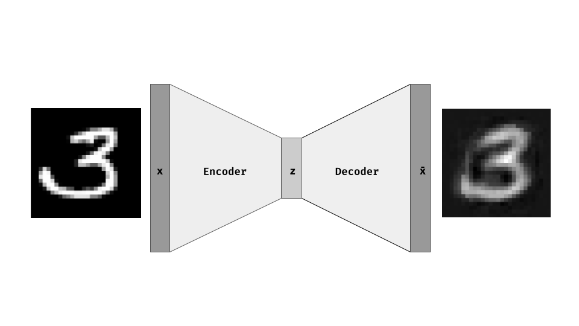
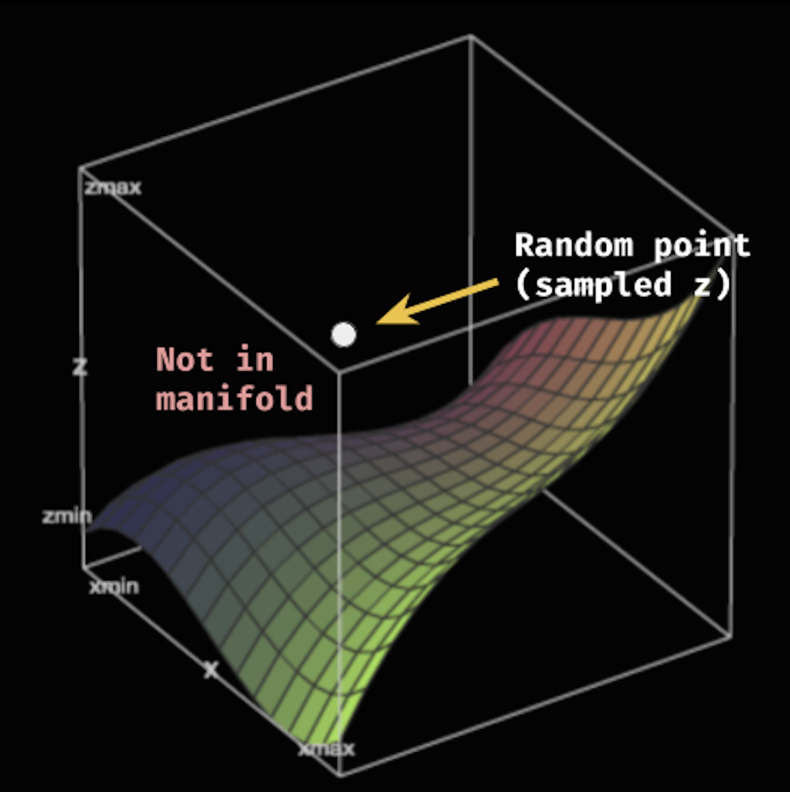
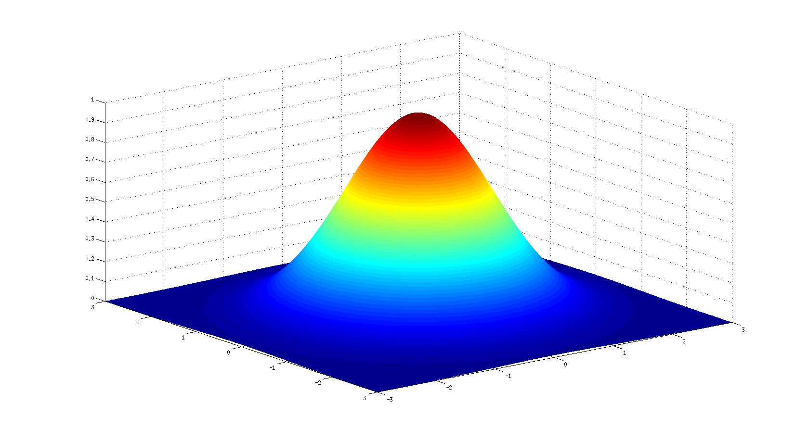
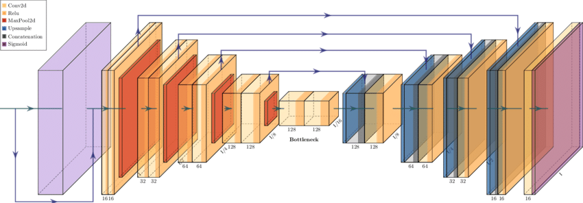
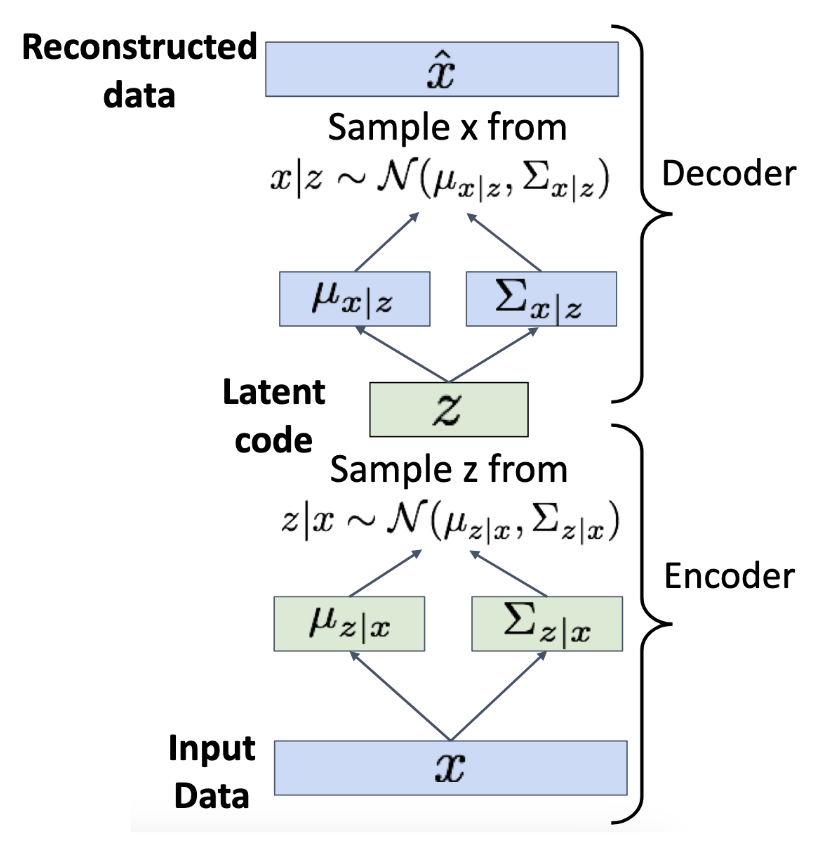
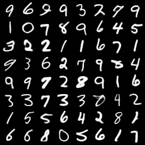
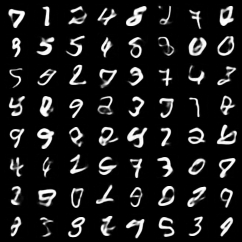
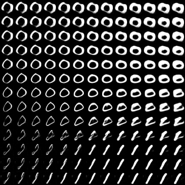

# Variational Autoencoder PyTorch 🌌🎲🧠

This is a PyTorch implementation of a Variational Autoencoder (VAE). [Paper reference]("https://arxiv.org/pdf/1312.6114.pdf) by Kingma & Welling

*currently under development*

# Autoencoders 🤖

**Autoencoders** are neural networks that try to reconstruct their input after being *reduced to a lower dimentional*. The autoencoder consists of two parts:
- **Encoder**: reduces the input to a lower dimentional representation (inside the ***latent space***).
- **Decoder**: tries to reconstruct the input from the lower dimentional representation (from the *latent code*).

<p align="center" width="100%"></p>

The key idea is that if the network is able to reconstruct the input from a lower dimentional representation, then it must have learned non-trivial and rich features of the input. The latent code can now be used for some downstream task (e.g. classification, clustering, etc).

# Variational Autoencoders (VAE) 🌌

Unfortunately, the latent space learned by a regular autoencoder is highly irregular, and we can't sample from it. Think about the original image space as a manifold inside a higher dimensional space [**(check out my video on the manifold hypothesis)**](https://www.youtube.com/watch?v=pdNYw6qwuNc). The latent space is a projection of the manifold into a lower dimensional space. 

<p align="center" width="100%"></p>


As you can see, the problem is that we can't just pick a random point in the latent space and expect to get a valid image, since there is technically a probability 0 of getting a point within the original manifold *(think about the probability of getting a specific point inside a square when sampling a random point from it)*.

**Variational Autoencoders** try to solve this problem by enforcing a **Gaussian distribution** over the latent space. This way, we can sample from a Gaussian (which is our latent space) and get a valid image.

<p align="center" width="100%">
    
    <p style="font-size: 10px; color: gray">Plotting a 3d gaussian function. <a href="https://www.mathworks.com/matlabcentral/answers/180778-plotting-a-3d-gaussian-function-using-surf">Source.</a></p> 
</p>

Thus, the loss function for a VAE is composed of two parts:
- **Reconstruction loss**: The reconstruction loss can be thought of as being the same as the loss function of a regular autoencoder. It tries to reconstruct the input from the latent code. In our case, we use [MSE](https://en.wikipedia.org/wiki/Mean_squared_error).
- **KL Divergence**: The [KL Divergence](https://en.wikipedia.org/wiki/Kullback%E2%80%93Leibler_divergence) is a measure of how different two distributions are. In our case, we want to measure how different the latent space distribution is from a unit diagonal Gaussian distribution.

# VAE architecture 🧠

I use a simple CNN based architecture for the encoder and decoder. 
- Encoder consists of:
    - Convolutional layers
    - Residual connections 
    - Max pooling (downsampling)
- Decoder consists of: 
    - Transpose convolutional layers 
    - Nearest neighbor upsampling

<p align="center" width="100%">
    
    <p style="font-size: 10px; color: gray">Diagram of similar architecture. <a href="https://www.researchgate.net/figure/The-self-aligned-CNN-architecture-used-for-predicting-landslides-Each-conv2d-uses-a_fig2_337208802">Source.</a></p>
</p>

**The encoder now outputs the `mean` and `log variance` of the latent space distribution.** We sample from this distribution and pass it to the decoder. The decoder then tries to **reconstruct the input** from the sampled latent space.

<p align="center" width="100%">
    
    <p style="font-size: 10px; color: gray">From lecture slides from EECS 498 Michigan University course. <a href="https://web.eecs.umich.edu/~justincj/slides/eecs498/498_FA2019_lecture20.pdf">Source.</a></p>
</p>

The KL divergence is computed as follows:
```python
def kl_divergence(mu, logvar):
    return -0.5 * torch.sum(1 + logvar - mu.pow(2) - logvar.exp())
```
And the reconstruction loss is computed as follows:
```python
def reconstruction_loss(x_hat, x):
    return F.mse_loss(x_hat, x, reduction="sum")
```
**The total loss is just the sum of the two.**

The encoder and decoder are trained jointly to minimize both the reconstruction loss and the KL divergence. From this prespective, the KL divergence can be thought of as a **regularization term** that forces the latent space distribution to be as close as possible to a unit diagonal Gaussian distribution.

**Note**: we use unit diagonal Gaussian distribution because it's simple and convenient (we can compute the KL-Divergence in closed form). If we didn't use just the diagonal, we'd end up needing to compute the entire covariance matrix, and our weight matrices will be astronomically large.

# Results 🎲

The VAE implemented in this repository is able to reconstruct images pretty well. Here are some examples (left is the original image, right is the reconstructed image):

<p align="center" width="100%">
    
    
</p>

Also, now the latent space is a Gaussian distribution, so we can sample from it and generate new images. Here I sample 64 images from the latent space:

<p align="center" width="100%">
    
</p>

I also tried encoding a real image into the latent space, and then slightly tweaking its latent code to generate a new image. Here are some examples where vertically I vary one dimention of the latent code, and horizontally I vary another dimention:

<p align="center" width="100%">
    
</p>

As you can see, the vertical latent code seems to encode how much of a `1` an image is, and the vertical one encodes how much of a `0` an image is.

TODO: experiment on datasets other than MNIST (e.g. CIFAR-10, CelebA, etc).